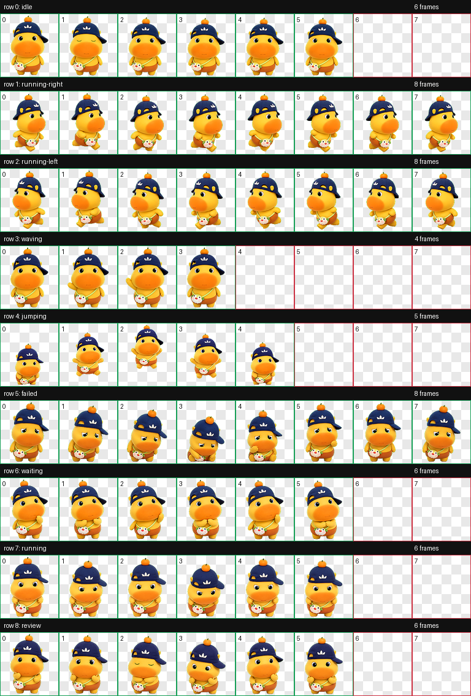

# CodexPet_Lulu

A ready-to-install Lulu desktop pet for Codex.

Lulu is a Codex-compatible animated pet packaged as a small repository that other users can clone and install directly. The pet is a round capybara-style 3D toy character with a navy side cap, tiny orange topper, soft yellow body, orange cheek muzzle, and a small crossbody pouch. The spritesheet avoids readable brand text or copied logo marks.



## Repository Description

Codex-compatible Lulu desktop pet: a cute animated capybara with an install script, WebP spritesheet atlas, motion previews, and validation artifacts.

## Quick Start

Clone the repository and run the installer:

```bash
git clone https://github.com/Jin-Ruoting/CodexPet_Lulu.git
cd CodexPet_Lulu
./install.sh
```

The installer copies the pet package into:

```text
${CODEX_HOME:-$HOME/.codex}/pets/lulu/
```

Restart Codex after installation, or refresh/select custom pets if your Codex build supports live pet discovery.

## Manual Installation

If you prefer not to run the script, install the two required files manually:

```bash
mkdir -p "${CODEX_HOME:-$HOME/.codex}/pets/lulu"
cp pet.json spritesheet.webp "${CODEX_HOME:-$HOME/.codex}/pets/lulu/"
```

The installed directory should contain:

```text
lulu/
  pet.json
  spritesheet.webp
```

## Package Contents

```text
.
|-- pet.json
|-- spritesheet.webp
|-- install.sh
|-- qa/
|   |-- contact-sheet.png
|   |-- review.json
|   |-- validation.json
|   `-- previews/
|       |-- idle.gif
|       |-- running-right.gif
|       |-- running-left.gif
|       |-- waving.gif
|       |-- jumping.gif
|       |-- failed.gif
|       |-- waiting.gif
|       |-- running.gif
|       `-- review.gif
`-- README.md
```

## Codex Pet Format

The package uses the standard Codex pet layout:

- `pet.json` defines the pet id, display name, description, and spritesheet path.
- `spritesheet.webp` is the final animated pet atlas.
- The atlas is `1536x1872`, arranged as 8 columns by 9 rows.
- Each frame cell is `192x208`.
- Unused cells are transparent.

## Animation States

The spritesheet includes all nine Codex pet rows:

| Row | State | Frames | Purpose |
| --- | --- | ---: | --- |
| 0 | `idle` | 6 | Calm breathing and blinking loop |
| 1 | `running-right` | 8 | Rightward drag movement |
| 2 | `running-left` | 8 | Leftward drag movement |
| 3 | `waving` | 4 | Friendly greeting |
| 4 | `jumping` | 5 | Playful vertical jump |
| 5 | `failed` | 8 | Failed or blocked reaction |
| 6 | `waiting` | 6 | Waiting for user input or approval |
| 7 | `running` | 6 | Focused active-work state |
| 8 | `review` | 6 | Reviewing or checking output |

## QA and Validation

The final atlas passed the hatch-pet validation workflow:

- Format: WebP RGBA
- Size: `1536x1872`
- Transparent RGB residue pixels: `0`
- Frame inspection errors: none

QA artifacts are included for review:

- `qa/contact-sheet.png` shows every atlas row and frame.
- `qa/previews/*.gif` provides lightweight motion previews for each state.
- `qa/validation.json` records atlas validation results.
- `qa/review.json` records frame inspection results.

## Notes

- This repository is intended to be clone-and-install friendly.
- The final packaged pet requires only `pet.json` and `spritesheet.webp`.
- QA files are included so users can inspect the asset before installing.
- Lulu is not affiliated with any brand shown or implied by the original reference image.
